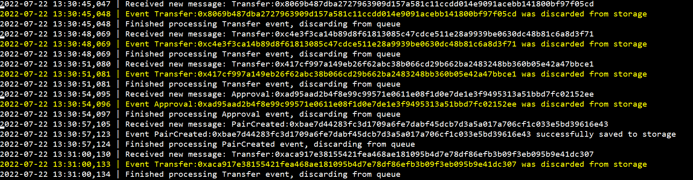

# bevents-index-processor
Reads messages from a RabbitMQ queue and stores the payload into a database in a specific format.

The system currently supports only [PairCreated](https://docs.uniswap.org/protocol/V2/reference/smart-contracts/factory#paircreated) 
events as sent in the format specified by [bevents-scraper output message format](https://github.com/abarbatei/bevents-scraper#output-message-format).

Concretely it expects messages with the following structure:
```json
{
    "event_name": "<the name of the smart contract event>",
    "filter_arguments": {
      // the arguments used as filter, specified in the contract-watchlist.json from bevents-scraper
    },
    "event_data": { // direct event data, raw, as returned by the RPC endpoint
        "args": {  
        },
        "event": "...",
        "logIndex": ...,
        "transactionIndex": ...,
        "transactionHash": "...",
        "address": "...",
        "blockHash": "...",
        "blockNumber": ...
    }
}
```

The `event_name` indicates what event type this is. As mentioned, only _PairCreated_ is currently supported.
All other events are consumed/discarded from the queue with a warning message only.


## RabbitMQ interaction and MongoDB connection string

The project reads RabbitMQ messages sent to a topic exchange via a routing key. 
In order to specify the queue/host and other configuration data, the following environment variables are required:
- `RABBIT_HOST_URL`: the hostname of the RabbitMQ server
- `RABBIT_HOST_PORT`: port number used in the above-mentioned host
- `RABBIT_EXCHANGE`: rabbit exchanged used where the messages are published
- `RABBIT_ROUTING_KEY`: the routing key used in publishing the messages
- `RABBIT_QUEUE_NAME`: the name of the queue that will be created on the server that is bound to this specific instances of 
_bevents-index-processor_. If running multiple instances (and you do not want all to consume from the same queue) make this name unique among running instances.
- `RABBIT_USER`: the username when logging to the message broker
- `RABBIT_PASSWORD`: the password corresponding to the above-mentioned user
- `MONGO_DB_CONNECTION_STRING`: the [MongoDB connection string](https://www.mongodb.com/docs/manual/reference/connection-string/) for connecting with the db


Example for a Windows .bat starter script:
```
@echo off

set RABBIT_HOST_URL=localhost
set RABBIT_HOST_PORT=5672
set RABBIT_EXCHANGE=events
set RABBIT_ROUTING_KEY=events.all
set RABBIT_QUEUE_NAME=events
set RABBIT_USER=guest
set RABBIT_PASSWORD=guest
set MONGO_DB_CONNECTION_STRING=mongodb://localhost:27017
main.py
```

## Setup

Project requires 
- that [bevents-scraper](https://github.com/abarbatei/bevents-scraper) be currently deployed and set up.
- the same rabbitMQ server used in _bevents-scraper_ to be used here, as mentioned in *RabbitMQ interaction* above
- the MongoDB server (mentioned bellow) to be functional and visible
- copy/download the project, ensure the required environment variables are set and deploy the project. Example shell launch:
```shell
git clone https://github.com/abarbatei/bevents-index-processor
cd ./bevents-index-processor
pip install -r /requirements.txt
./start.sh
```

The `start.sh` would be the equivalent to the Windows example but in shell.

## MongoDB setup and interaction

Project connects and inserts data (one by one) into the MongoDB specified in `MONGO_DB_CONNECTION_STRING`.
It adds an extra `t` field to the json, containing the UNIX time of when the data (document) was inserted to the database.

Insertion is done in the `events` mongo database and `PairCreated` collection with the following document schema:
```json
{
    "_id": <MongoObjectID>,
    "t": <UNIX timestamp of insertion, as seconds>,
    "event_name": <the name of the smart contract event>,
    "filter_arguments": {
      // the arguments used as filter, specified in the contract-watchlist.json from bevents-scraper
    },
    "event_data": { direct event data, raw, as returned by the RPC endpoint
        "args": {
            "token0": <first token address>
            "token1": <second token address>,
            "pair": <pair pool address>,
            "": <number indicating the how many times this event was issued up untill this point>
        },
        "event": "...",
        "logIndex": ...,
        "transactionIndex": ...,
        "transactionHash": "...",
        "address": "...",
        "blockHash": "...",
        "blockNumber": ...
    }
}
```

The collection has the following indexes:
```json
{
    "_id_": {"v": 2, "key": [("_id", 1)]}, 
    "process_time": {"v": 2, "key": [("t", 1)], "background": False}, 
    "pair_address": {"v": 2, "key": [("event_data.args.pair", 1)], "background": False}, 
    "contract_address": {"v": 2, "key": [("event_data.address", 1)], "background": False}, 
    "tx_hash": {"v": 2, "key": [("event_data.transactionHash", 1)], "background": False}, 
    "token0_address": {"v": 2, "key": [("event_data.args.token0", 1)], "background": False}, 
    "token1_address": {"v": 2, "key": [("event_data.args.token1", 1)], "background": False}
}
```
## Extending and testing

Extending the code is straightforward, clone, set it up and develop.
Testing is done using pytest, install development requirements for full required packages
`pip install -r requirements-dev.txt`

In order to run tests a subset of connections needs to be passed for object initialisations. 
Required configs are same as for the initial but with testing in (e.g. a local server).

You can use the provided `runtests.bat` script if on Windows.
Depending on your preferences, you can choose to create a testing queue for the RabbitMQ server
or use a different server, the environment variables in the testing script allow this.

However, for the database, it is currently set that you need to use a testing purposed data base, 
the database/collection used by the script is not configurable at the moment.

